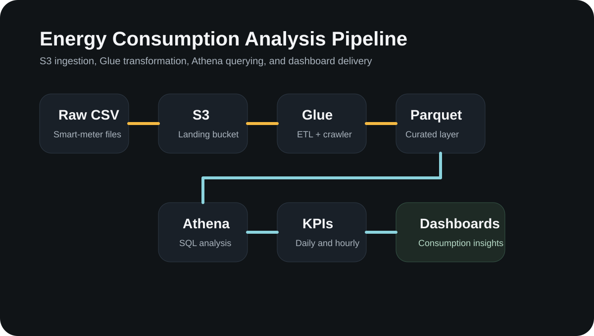
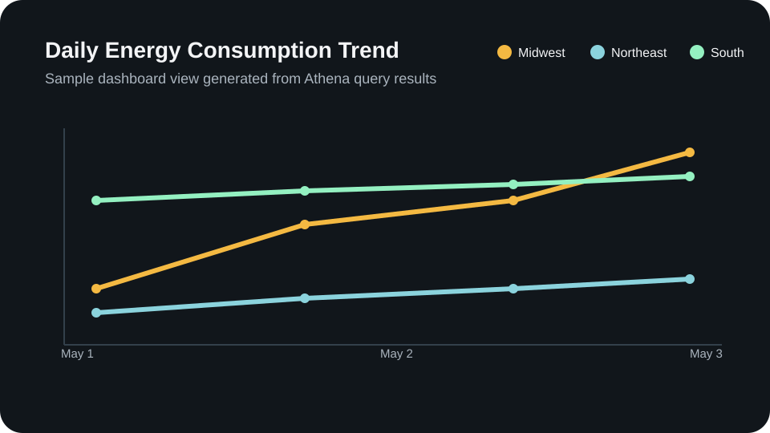

# Energy Consumption Analysis

An industrial-style AWS data engineering case study for processing smart-meter energy readings into query-ready analytical datasets. The repo is organized like a production analytics project, with local transformation code, cloud ETL jobs, orchestration, infrastructure-as-code, tests, configs, and technical documentation.

## Highlights

- Built around an end-to-end flow using Amazon S3, AWS Glue, Athena, and Parquet
- Includes application-style Python modules, Airflow orchestration, Terraform infra, and CI
- Separates local logic from managed cloud runtime so testing and operations are easier to reason about
- Includes diagrams, sample data, and readable docs for quick review

## Preview




## Live Demo

[Open the Streamlit app](https://energy-comsumption-analysis-bindhu.streamlit.app)

## Structure

```text
.
├── code
│   └── sql
│       └── athena_queries.sql
├── configs
│   ├── dev.yaml
│   └── prod.yaml
├── data
│   ├── processed
│   │   └── daily_consumption_summary.csv
│   └── raw
│       └── energy_readings_sample.csv
├── docs
│   ├── architecture.md
│   ├── data-contract.md
│   └── runbooks
│       └── local-development.md
├── infra
│   └── terraform
│       ├── main.tf
│       ├── outputs.tf
│       └── variables.tf
├── jobs
│   └── glue
│       └── curated_pipeline.py
├── orchestration
│   └── airflow
│       └── dag_energy_pipeline.py
├── scripts
│   └── run_local.py
├── src
│   └── energy_analytics
│       ├── __init__.py
│       ├── config.py
│       ├── quality.py
│       └── transformations.py
├── streamlit_app.py
├── tests
│   └── test_transformations.py
├── visuals
│   ├── architecture
│   │   └── aws-pipeline-diagram.svg
│   └── dashboards
│       ├── daily-consumption-chart.svg
│       └── hourly-heatmap.svg
├── Makefile
├── pyproject.toml
└── README.md
```

## Architecture Flow

1. Raw smart-meter CSV files land in Amazon S3.
2. Validation and transformation logic standardize schema, remove duplicates, and apply quality checks.
3. Curated data is written in Parquet format with partitions for efficient querying.
4. Amazon Athena powers SQL-based analysis for daily and hourly usage patterns.
5. Airflow orchestration coordinates scheduled execution and post-run publishing steps.
6. Dashboard visuals communicate peaks, trends, and operational insights.

## Key Deliverables

- [Raw sample data](./data/raw/energy_readings_sample.csv)
- [Processed summary output](./data/processed/daily_consumption_summary.csv)
- [Local transformation package](./src/energy_analytics/transformations.py)
- [Glue ETL job](./jobs/glue/curated_pipeline.py)
- [Athena SQL queries](./code/sql/athena_queries.sql)
- [Airflow DAG](./orchestration/airflow/dag_energy_pipeline.py)
- [Terraform infra](./infra/terraform/main.tf)
- [Architecture visual](./visuals/architecture/aws-pipeline-diagram.svg)
- [Dashboard visuals](./visuals/dashboards/daily-consumption-chart.svg)
- [Architecture notes](./docs/architecture.md)
- [Data contract](./docs/data-contract.md)

## Run locally

```bash
python3 -m pip install -e ".[dev]"
python3 scripts/run_local.py --config configs/dev.yaml
python3 -m pytest
```

## Streamlit Demo

Run the interactive dashboard locally:

```bash
python3 -m pip install -e ".[dev]"
streamlit run streamlit_app.py
```

The demo reads from:

- `data/raw/energy_readings_sample.csv`
- `data/processed/daily_consumption_summary.csv`
- `visuals/architecture/aws-pipeline-diagram.svg`

## Customize before pushing

- Swap the sample CSV data with your real project dataset if available
- Update the ETL script, SQL, and Terraform variables to match your actual environment
- Rename buckets, databases, and workgroups to your preferred naming standard
